# CPU
## Introduction
This project was made by Roi Bachynskyi, student from 1231EB. I have chosen this project to study RISC-V assembly better and to study how a processor works deeper.

The main purpose of it is to emulate a RISC-V 32I CPU so that it is possible to write RISC-V assembly code, i.e. it "understands" RISC-V ISA, pass it to the [assembler](https://riscvasm.lucasteske.dev/#), insert the necessary bytes to the instruction memory and the data memory, and use it.

This project is based on [Holy Core](https://github.com/0BAB1/HOLY_CORE_COURSE/blob/master/0_single_cycle_edition/single_cycle_edition.md) GitHub page and this [RISC-V Logisim playlist](https://www.youtube.com/watch?v=Z7LHCMTc0gI&list=PLM8YDhk_PWu0pdBNHMMSiBm8CEkCQ94T8) on YouTube. 

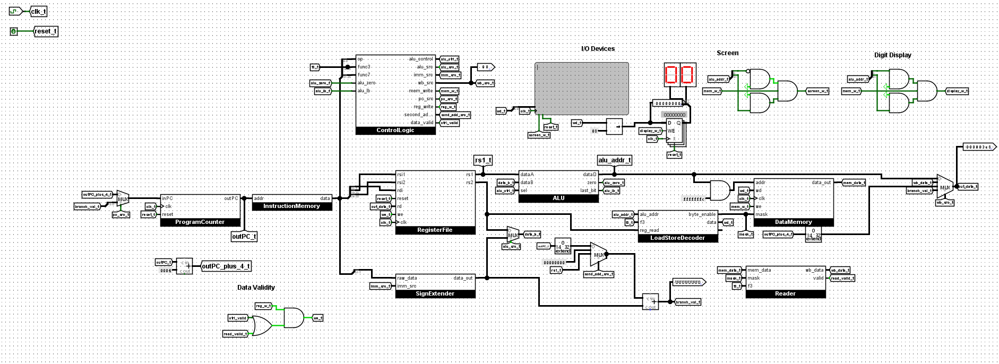 

The report is split into several categories where every component is studied in all details.

This CPU accepts *32-bit words*, the **data bus** is *32 bits long* and the **address bus** is *32 bits long*. 

> [!NOTE]  
For better appearance and readability, I used **tunnels** to components between each other.

## Program Counter
Let us start from the very beginning. Firstly, I implemented the **counter**, the component that will set the address for the instruction memory.

> [!NOTE]  
Technically speaking, this project represents **Harvard architecture** where instruction and data memory are accessed using different buses.

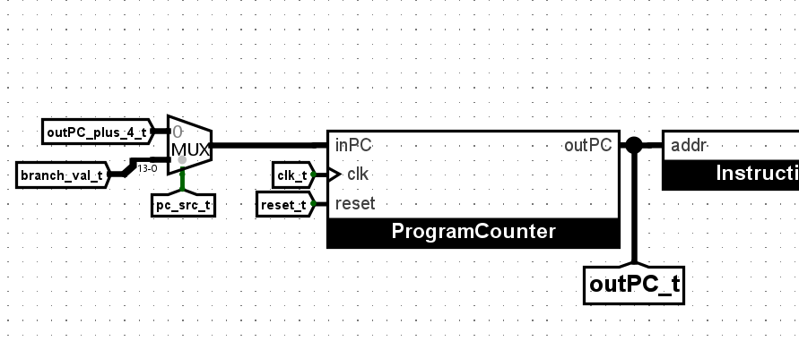
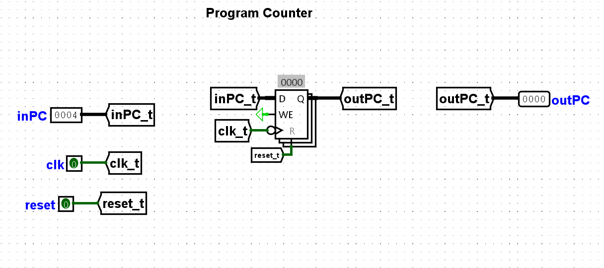

**Inputs**: 
- *inPC* = next value of the counter
- *clock* 
- *reset*

**Outputs**: 
- *outPC* = current value of the counter that goes into the instruction memory

A simple register (14 bits width, the program is not going to be too large) that accepts the next value of the counter (either PC+4 or branch value, i.e. in case of any jump)

> [!NOTE]  
RV32I provides a 32-bit address space that is **byte-addressed**. This is why a program counter is incremented with 4 (32 bits = 4 bytes). 

I did not want to use the built-in counter because it was easy to make my own simple version which is sufficient for this implementation. Only register with Write Enable always on which is updated everty clock cycle.

## Instruction Memory

**Instruction memory** supplies the control logic and ALU with instructions that are performed.

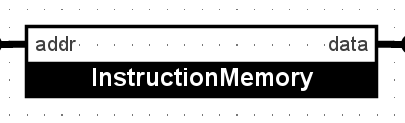
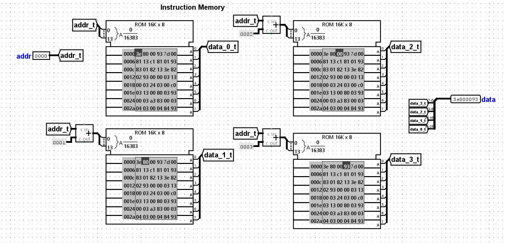

**Inputs**: 
- *addr* = address for instruction ROM

**Outputs**: 
- *data* = data fetched from the ROM

> [!CAUTION]
Despite the fact that address is 24 bit max and data is 32 bit max in Logisim's ROM, I decided to make it smaller so that I can easily save the contents of the memory and load it back. 

RISC-V's byte-addressed memory and Logisim capabilities has influenced the design: instead of simply putting one ROM with 32 bits for address and 32 bits for data, following the byte-addressed memory approach, I put 4 ROMs with 8 bits for data and 14 bits for address (because of the [PC](#program-counter)). Every ROM except the first one has an adder that adds the necessary offset. After outputting the data, using splitter, an instruction is generated by 4 combined outputs of ROMs. 

> [!WARNING]  
If I had had more time for implementing such a ROM that outputs 4 separate bytes in one clock cycle, I would have not made such a bad design for instruction memory

> [!IMPORTANT]  
To use the assembled code, ROMs are loaded by the same code and 32 bits are read in a clock cycle. See more on [programming](#program).

## Instruction Types
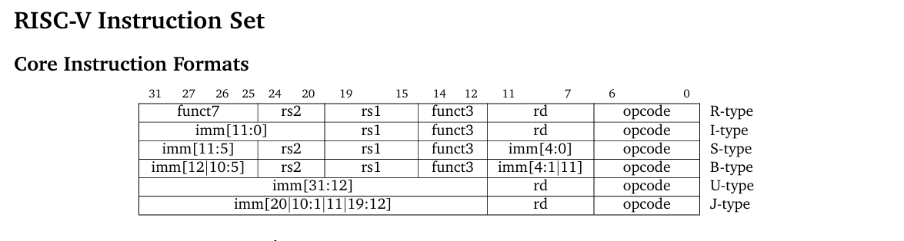

This table will be frequently used in the following sections. Let us list them and try to make clear how the instructions are composed. To distinguish the instruction types, there is an *opcode* in every instruction (7 bits always). 

*Other parts:*

- *rs1* = index of source register 1 (read-only)
- *rs2* = index of source register 2 (read-only)
- *rd* = index of destination register (write-only) 
- *imm* = immediate value
- *funct3* = main specifier of the particular instruction
- *funct7* = secondary specifier of the particular instruction

*Instruction Types:*

- **R-type** = register type, performs operations only with registers and stores result in a register
- **I-type** = immediate type, performs operations with a register and an immediate value and stores result in a register OR load data from RAM at specified address (specified by a register) and offset (immediate) into a register
- **S-type** = store type, store data from a register at specified address (specified by a register) and offset (immediate)
  
> [!NOTE]  
RV32I has a **load–store architecture**, i.e there are separate instructions for memory access and ALU operations. It means there is no `MOV` instruction that can be used both with registers and memory. 

- **B-type** = branch type, changes the PC depending on the result of an operation made on two registers
- **U-type** = upper type, performs operations with upper 20 bits of immediate and stores result in a register 

> [!NOTE]  
I-type instructions perform operations only on 12-bit immediates, thus making sense for U-type instructions.

- **J-type** = jump type, adds an immediate value to the PC

> [!NOTE]  
For all the intructions, go to [RISC-V ISA document](https://www.cs.sfu.ca/~ashriram/Courses/CS295/assets/notebooks/RISCV/RISCV_CARD.pdf)

## Register File

RISC-V 32I has 32 registers with 32-bit words as entries.

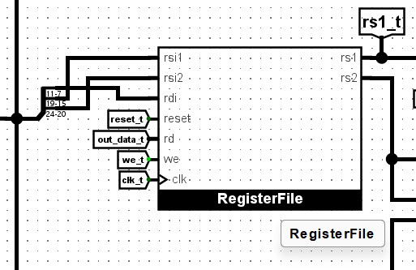

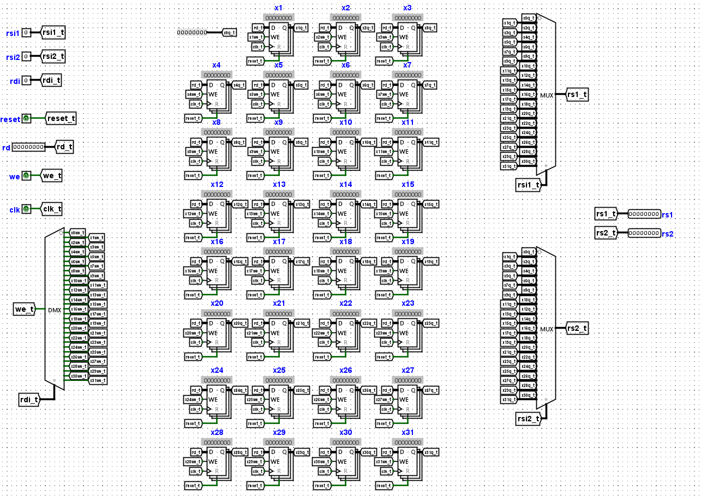

**Inputs**:
- rsi1 = index of source register 1 (read-only)
- rsi2 = index of source register 2 (read-only)
- rdi = index of destination register (write-only)
- reset
- rd = data to write into the destination registor
- we = write enable controlling when to write into register
- clk

**Outputs**:
- rs1 = source register 1 data
- rs2 = source register 2 data

It seems to be a big part, but in essence, it is really simple. There are 32 bits that can be encoded using 5 bits (2^5 = 32). To address any of the registers, indices are used that route the data from and to registers using DEMUX for writing and MUX and reading.

> [!IMPORTANT]  
x0 has always to be zero, no data can be written into it. It is a handy register used when comparing with zero is needed.


## Sign Extender
As it can be observed, immediate values are written differently in each instruction type. There is a need to reshuffle some bits or shift them and expand the value up to 32 bits to perform operations in the ALU, add immediates to PC (yes, and reduce to 14 bits...) or load into registers.

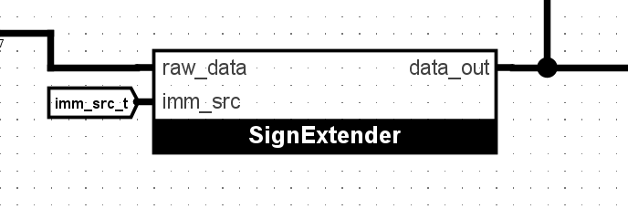

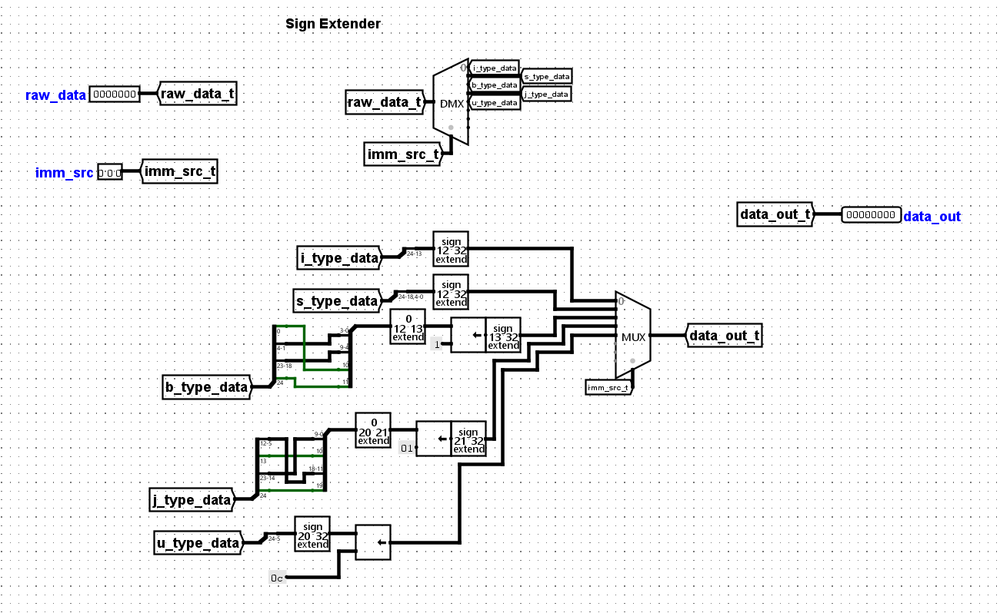

**Inputs**:
- raw_data = 25 bits of instruction (without opcode)
- imm_src = immediate source deciding what transformation to apply on it

**Outputs**:
- data_out = result

DEMUX and MUX are used again to filter out the transformation based on the instruction type. For I-type and S-type it is a simple sign extension, for B-type and J-type it is reshuffling, left shifting by 1 (because there are no correct instructions with odd number) and sign extenstion, for U-type it is left shifting by 12.

## Arithmetic Logic Unit aka ALU

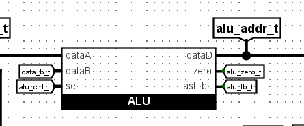

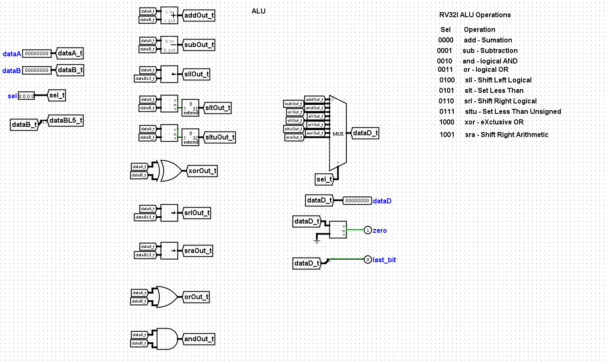

A calculator that can perform basic operations.

**Inputs**:
- dataA = first operand
- dataB = second operand
- sel = operation selection

**Outputs**:
- dataD = result
- zero = zero flag
- last_bit = 1 or 0, used for branching `bgt` and `blt`

| Sel         | Operation   |
| ----------- | ----------- |
| 0000      | add - summation|
| 0001      | sub - subtraction|
| 0010      | and - logical AND|
| 0011      | or - logical OR|
| 0100      | sll - Shift Left Logical|
| 0101      | slt - Set Less Than|
| 0110      | srl - Shift Right Logical|
| 0111      | sltu - Set Less Than Unsigned|
| 1000      | xor - eXclusive OR|
| 1001      | sra - Shift Right Arithmetic|

Depending on the `sel` value the corresponding result is output using a MUX.

`zero` and `last bit` act as a flag for branching instructions.


## Data Memory
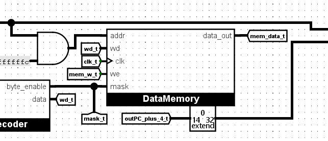

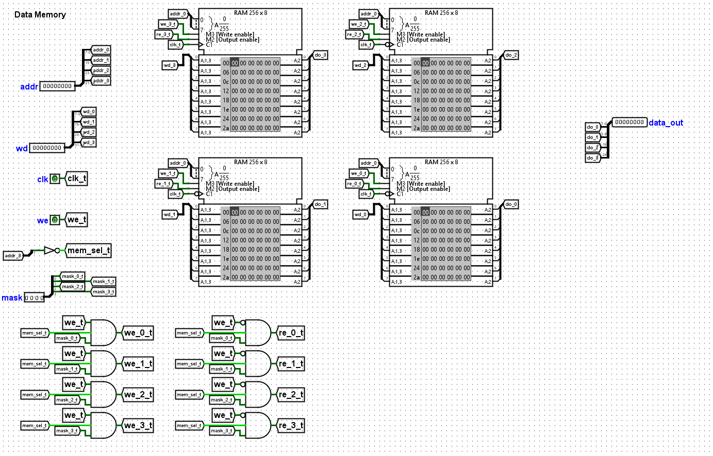

Data memory that acts as RAM for the CPU. Built by 4 Logisim's RAM elements. 

**Inputs**:
- addr = 32-bit address
- wd = data to write
- clk
- we = write enable (0 to read and 1 to write)
- mask (later in [load-store decoder](#load-store-decoder))
  
**Outputs**:
- data_out

Since RV32I provides a 32-bit address space that is **byte-addressed**, it is vitally important to access bytes separately if a byte or a half has to be read (`mask`'s purpose, see more at [load-store decoder](#load-store-decoder)). For this purpose, RAM is represented by 4 chips with 8 bits for address (`addr` is split into 4 8-bit subaddresses, for this implementation, only byte 0 is used for addressing) and 8 bits for data (4 gathered bytes are combined into one 32-bit word).

Additionally, I split the memory into 2 parts so that I have Memory-Mapped I/O (MMIO):
- Data Memory (00..0 - 01..1)
- [I/O devices](#io) (10..0 - 11..1)

The very last bit decides if the data goes into memory or into I/O devices (0 = memory, 1 = I/O devices).

> [!IMPORTANT]  
`addr` is loaded without its last byte because `mask` decides what bytes have to be accessed and adds them back to the address.

> [!WARNING]  
If I had had more time for implementing such a RAM that outputs 4 separate bytes in one clock cycle, I would have not made such a bad design for data memory.

## Load-Store Decoder

As it was said in the previous section, the address space is **byte-addressed**, therefore, the RISC-V Instruction Set Architecture (ISA) allows accessing separate bytes, halves and a word. Here `funct3` decides what type of data is accessed/written to RAM.

| funct3       | Type of Data   |
| ----------- | ----------- |
| 000      | Byte|
| 001      | Half|
| 010      | Word|
| 100      | Byte(U)|
| 101      | Half(U)|

> [!IMPORTANT]  
`U` means unsigned, the third bit decides if the operation is signed (0) or unsigned (1).

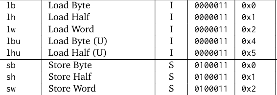

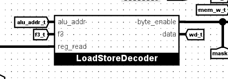

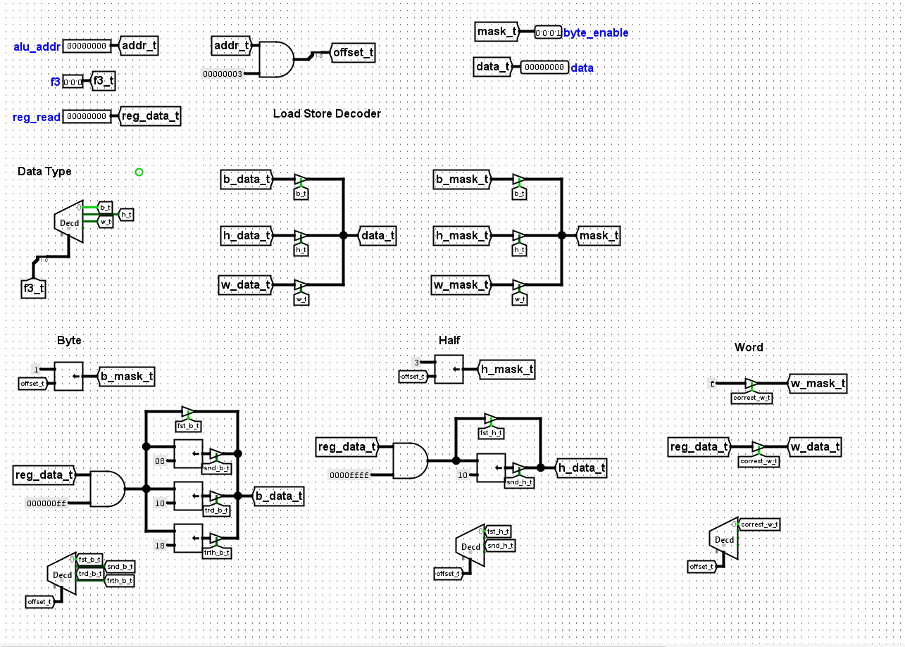

**Inputs**:
- alu_addr = address computed at ALU
- f3 = `funct3` specifing data type, `byte`, `half`, or `word`
- reg_read = data that is going to be written in case of `store` instruction

**Outputs**:
- byte_enable = `mask`, specifing what parts of word to read
- data = prepared data, i.e. shifted if needed to place to the right offset

This component 'prepares' data, i.e. depending on `funct3` it extracts the requested amount of data, depending on `alu_addr` offset is determined choosing the place where the data portion should be placed.
  
> [!NOTE]  
Conditional data transformation is implemented using decoder based on select bits, controlled buffers that decide whether to open the 'valve' of data or not. I couldn't come up with an idea how to make it more optimized.

## Reader
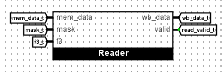
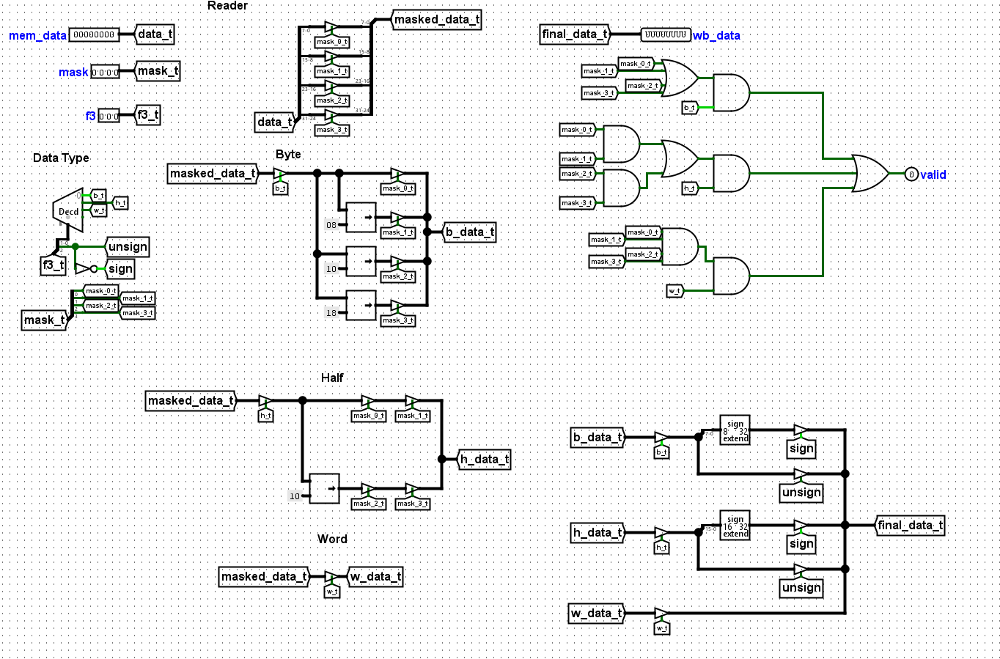

**Inputs**:
- mem_data = data read from memory
- mask = mask computed at [load-store decoder](#load-store-decoder)
- f3 = `funct3`

**Outputs**:
- wb_data = processed data, i.e. data shifted to farthest possible right position
- valid = if any of `mask` bits is not zero, data is considered to be valid

After reading, the data is checked whether it is valid for writing back into the register and, if needed, is shifted to farthest possible right position based on its mask. Conditional buffers are used to decide what transformations should be applied based on `funct3`: shifting, signed/unsigned extenstion.

| funct3       | Type of Data   |
| ----------- | ----------- |
| 000      | Byte|
| 001      | Half|
| 010      | Word|
| 100      | Byte(U)|
| 101      | Half(U)|

## Control Logic & MUXes
### Introduction

Control logic is the most important component in the CPU, it controls how every device works depending on the provided instruction.

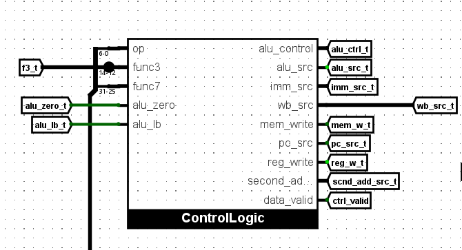

**Inputs**:
- op = `opcode` that detects the instruction type
- func3 = `funct3` , main specifier of the function
- func7 = `funct7`, secondary specifier of the function
- alu_zero = a kind of flag that is used in branching (if the result is zero)
- alu_lb = a kind of flag that is used in branching (if the first operand is larger or not)

**Outputs**:
- alu_control
- alu_src
- imm_src
- wb_src
- mem_write
- pc_src
- reg_write
- second_add_src
- data_valid

The outputs will be explained in the following subsections.

### Instruction Type Detection

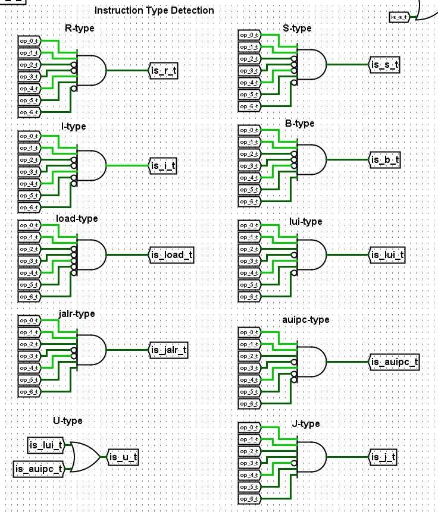

| `opcode`       | Instruction Type   |
| ----------- | ----------- |
| 0110011      | R-type|
| 0010011      | I-type|
| 0000011      | Load type|
| 0100011      | S-type|
| 1100011      | B-type|
| 1101111      | J-type|
| 1100111      |`jalr` type|
| 0110111      |`lui` type|
| 0010111     |`auipc` type|

Despite the fact that there are 5 types of instructions, in RV32I there are 9 unique types of opcodes which are presented in the data. After detecting the instruction, it is possible to understand what to do with other outputs.

### Immediate Source
| Instruction Type | `imm_src`   |
| ----------- | ----------- |
| load-type   | 000 |
| I-type   | 000 |
| S-type   | 001 |
| B-type   | 010 |
| J-type   | 011 |
| U-type   | 100 |

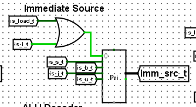

Here a priority encoder is used to output the `imm_src` based on the instruction type.

The `imm_src` is an input for [Sign Extender](#sign-extender), which decides how immediate is placed in the instruction and serves as a select for MUX inside it.


### ALU

| Instruction Type | `alu_op`|
| ----------- | ----------- |
| load-type OR S-type | 00 |
| B-type | 01 |
| I-type OR R-type | 10 |

Typically, ALU can work in 3 modes, i.e. 1) compute addresses for load-store intructions, 2) subtract register values to define what to do: to branch or not, 3) math operations. To distinguish these operations, `alu_op` is used.

It is implemented using priority encoders and decoders. Based on the `alu_op`, the appropriate operation mode is enabled.

> [!NOTE]  
It is easier and more optimal to make it with OR gate, but I wanted to make sure that no two instruction types shoot (theoretically, it is impossible, but to be sure).

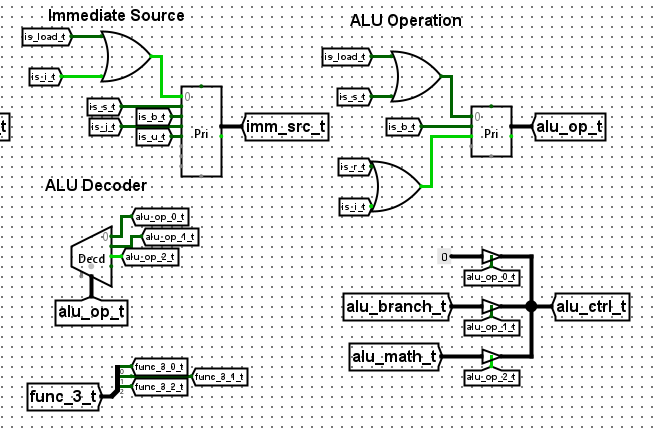

Load-store mode always returns `add` (i.e. 0000) as an operation to the `alu_ctrl`.

Branch mode returns 3 operations based on the branching instruction (see more at [Branching](#branching)):
| Instruction | `alu_ctrl`|
| ----------- | ----------- |
| `beq` or `bne` | 0001 (`sub` = subtract) |
| `blt` or `bge` | 0101 (`slt` = set less than) |
| `bltu` or `bgeu` | 0111 (`sltu` = set less than unsigned) |

Math operation is as follows:

| Instruction | funct3 | {op_5, funct7_5} | `alu_ctrl`|
| ----------- | ----------- | ----------- | ----------- |
| `add` OR `addi` | 000 | 00, 01, 10 OR xx | 0000|
| `sub` | 000      | 11 | 0001|
| `and` OR `andi` | 010 | x | 0010|
| `or` OR `ori` | 110 | x | 0011|
| `sll` OR `slli` | 001 | x0 OR imm[5:11]=0x00 | 0100|
| `slt` OR `slti` | 010 | x | 0101|
| `srl` OR `srli` | 101 | x0 OR imm[5:11]=0x00 | 0110|
| `sltu` OR `sltiu` | 011 | x | 0111|
| `xor` OR `xori` | 100 | x | 1000|
| `sra` OR `srai` | 010 | x1 OR imm[5:11]=0x20 | 1001|

> [!NOTE]  
x means any value. For every entry with OR each instruction treats `{op_5, funct7_5}` depending on the position in OR (e.g. `add` OR `addi` => `add` needs 00,01,10 only for `{op_5, funct7_5}` whereas `addi` takes 'don't care'). There is a mix of I-type and R-type instructions here.

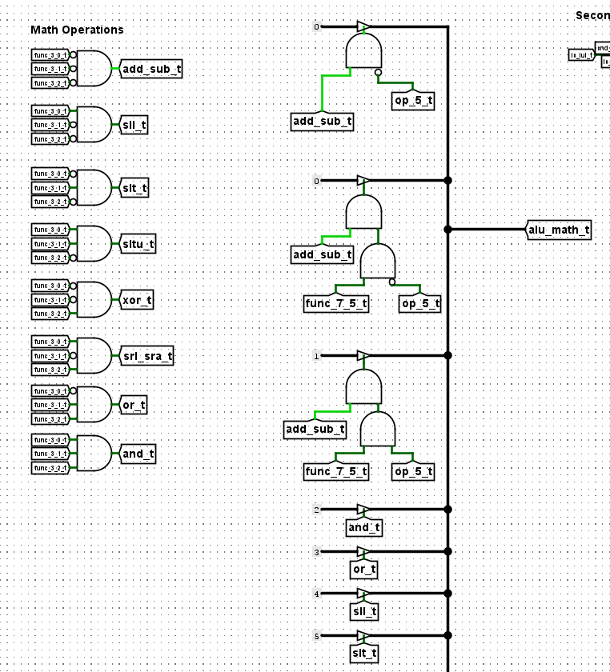
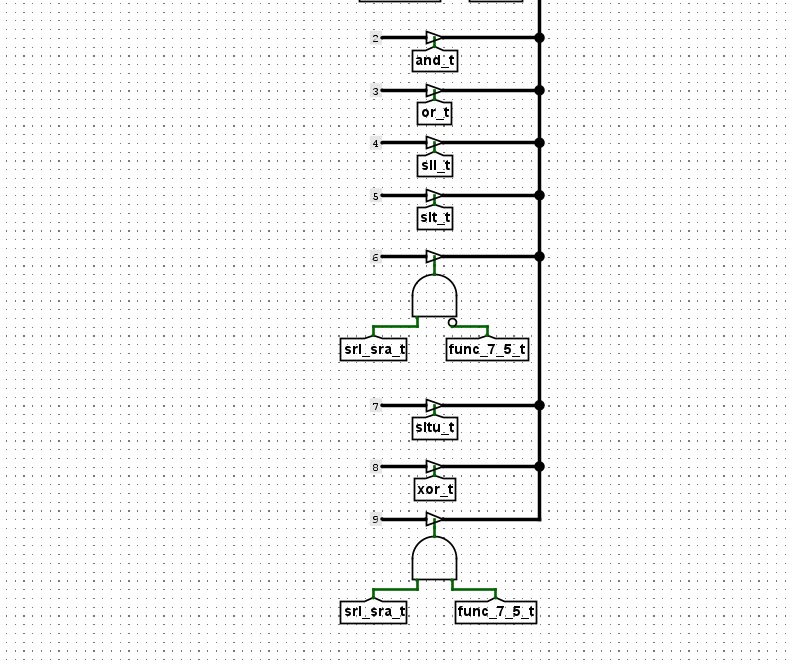

There are conditional buffers that can be activated by specified values so that only one constant can be output to the `alu_ctrl` based on `funct3` and other components.

> [!IMPORTANT]  
There is a way to implement such things using ROM instead of hardwired logic ([video](https://www.youtube.com/watch?v=CTBdFIsQc4M&list=PLM8YDhk_PWu0pdBNHMMSiBm8CEkCQ94T8&index=7)). Actually, ROMs were commonly used to implement control units. But I decided to leave the implementation with simple gates.

### Second Add Source

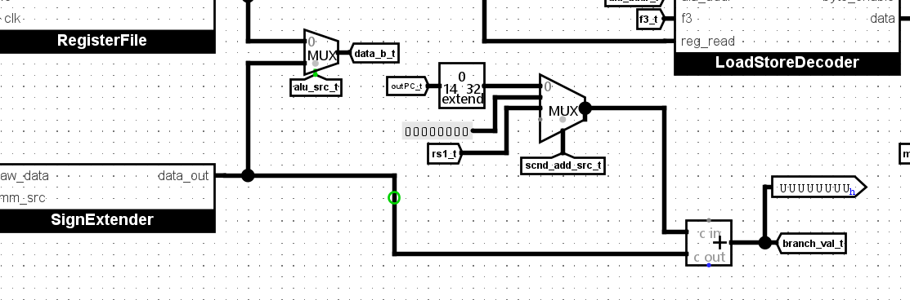

> [!IMPORTANT]  
The tunnel `branch_val_t` has an unappropriate name, it should have had a better name because it is not only about branching and its value is also written to registers, I haven't come up with a better idea back then and left it as-is.

There are some operations that use immediates and do bypass ALU usign a separate adder. They are:

| Instruction Type | `scnd_add_src` | Function |
| ----------- | ----------- | ----------- |
| B-type OR `auipc` type OR J-type | 00 | `PC += imm` |
| `lui` type   | 01 | `rd = imm << 12` |
| `jalr` type   | 10 | `PC = rs1 + imm` |

The first type just adds new immediates to the PC, the second type takes nothing and is just preparation of the upper 20 bits for the destination register, and the last type is adding an immediate to the source register. A priority encoder is used to output the `scnd_add_src` based on the intruction type.

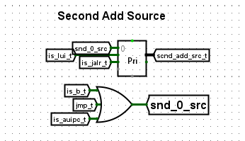

### Branching

Everything that adjusts the PC in some way is described in this section, i.e. B-type instructions, J-type instructions, `pc_src` and so on.

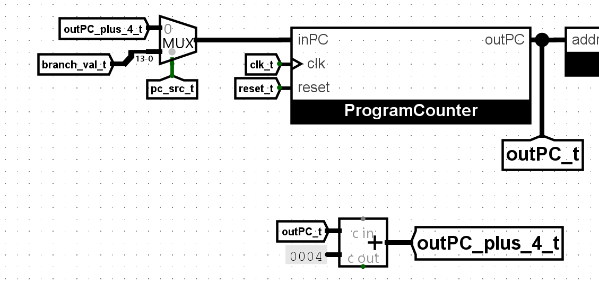

Tunnel `branch_val_t` determines what value to write into PC and tunnel `pc_src_t` selects what value to write: either just add 4 to PC or a new value. The data is written only in case all the conditions are fulfilled.

Tunnel `pc_src_t` is 1 if and only if:
- B-type instruction in executed and the ALU flag has the appropriate value
- J-type instruction
- `jalr` instruction

Other instructions set `pc_src_t` value as 0 so that the subsequent instruction is used.

| Instruction | `funct3` | Function | ALU Operation | ALU Flag |
| ----------- | ----------- | ----------- | ----------- | ----------- |
| `beq` | 0x0 | `if (rs1 == rs2) PC += imm` | 0x1 | `alu_zero == 1` |
| `bne` | 0x1 | `if (rs1 != rs2) PC += imm` | 0x1 | `alu_zero == 1` |
| `blt` | 0x4 | `if (rs1 < rs2) PC += imm` | 0x5 | `alu_last_bit == 1` |
| `bge` | 0x5 | `if (rs1 >= rs2) PC += imm` | 0x5 | `alu_last_bit == 0` |
| `bltu` | 0x6 | `if (rs1 < rs2) PC += imm` (Unsigned) | 0x7 | `alu_last_bit == 1` |
| `bgeu` | 0x7 | `if (rs1 >= rs2) PC += imm` (Unsigned) | 0x7 | `alu_last_bit == 0` |

J-type instruction and `jalr` don't depend on any conditions, just set the value for the PC.

This is how it was implemented in Logisim.

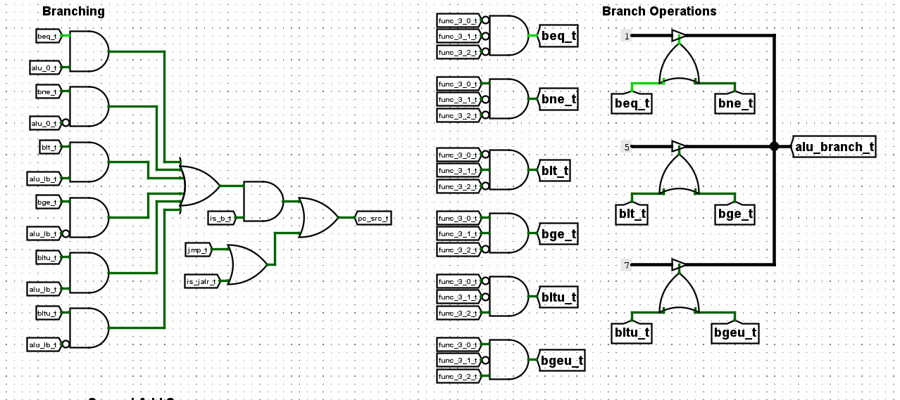

### Write Back

There are several sources of new values that can be written to the destination register.

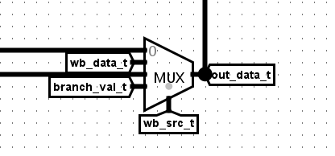

| Instruction Type | `wb_src` | Function |
| ----------- | ----------- | ----------- |
| I-type OR R-type OR B-type OR S-type | 00 | Write the result of ALU operation |
| load-type | 01 | Write the value obtained from the Reader |
| J-type OR `jalr` | 10 | Save the `PC + 4` value |
| U-type | 11 | Write either `imm << 12` OR `PC + (imm << 12)` |

It was implemented using priority encoder. For value 00, it was simplified a bit (no I-type OR R-type OR B-type OR S-type there), NOT load-type is sufficient because priority encoded is sufficient to handle several values and chooses the largest among the inputs.

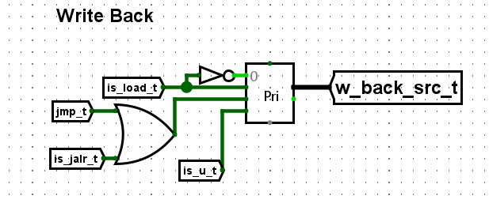

### Other important control outputs

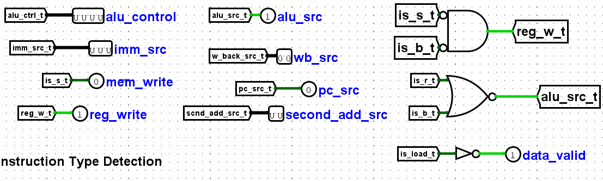

- `data_valid` = It is 1 if and only if the instruction is not of load type. In this way the data memory check is separated from the control logic as it is handled in [Reader](#reader).
  
- `reg_w` = It is 1 if and only if the instruction is neither of S-type nor of B-type. Other types write to the register.
  
  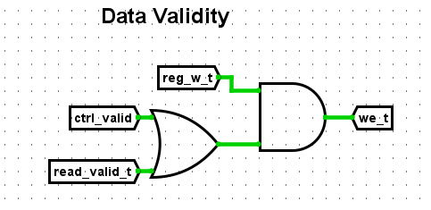

- `mem_write` = It is 1 if and only if the instruction is of S-type. It enables `we` flag in [Data Memory](#data-memory) and allows writing to memory.

## I/O
As it was stated in the section [Data Memory](#data-memory), this project uses Memory-Mapped I/O, i.e in order to read or write (in this case only write) to I/O devices.

I have chosen to make two simple I/O devices: screen, which is just a Logisim's TTY, and digital display, which is effectively two Logisim's hex digit displays.

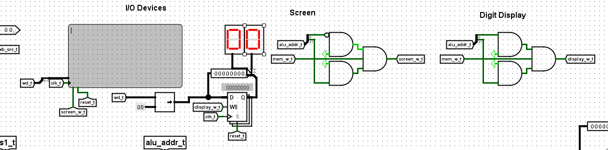

Memory mapping:
- Screen = 1xx..xx0
- Digital Display = 1xx..xx1
  
> [!NOTE]  
`x` means any bit.

Writing to one of these addresses pulls a chip-select-like write enable that selects the device and writes the actual data.

For digital display, there is a register that keeps the last written value, there is no need for such a setup for a screen because it has its own register that shifts and stores the last written data (ASCII code).

> [!IMPORTANT]  
The right shift register is used at the digital display because any time the address 1xx..xx1 is accessed, load-store decoder shifts by 8 bits to the left, to mitigate this, the right shifter was added.

## Demo
### Program

To demostrate the capabilities of the project, a little RISC-V program was written that writes data to registers, makes operations with them, reads data from RAM, counts up to 0x25 on the digital display and writes a text on the screen.

Here is the code:
```assembly
.global _boot
.text

_boot:                    /* x0  = 0    0x000 */
    /* Test ADDI */
    addi x1 , x0,   1000  /* x1  = 1000 0x3E8 */
    addi x2 , x1,   2000  /* x2  = 3000 0xBB8 */
    addi x3 , x2,  -1000  /* x3  = 2000 0x7D0 */
    addi x4 , x3,  -2000  /* x4  = 0    0x000 */
    addi x5 , x4,   1000  /* x5  = 1000 0x3E8 */
/*Fetch data from memory and prepare for the counter loop*/
    la x6, variable
    lw x8, 0(x6)
	  la x6, count
    la x7, display
    lw x7, 0(x7)
    lb x8, 0(x6)
    addi x9, x9, 0
_counter:
	sb x9, 0(x7)
    addi x9, x9, 1
    addi x8, x8, -1
    bne x8, x0, _counter
/*Fetch data from memory and prepare for the text loop*/
 	la x6, screen
    lw x6, 0(x6)
    la x9, hello
    lb x8, 0(x9)
_writer:
    sb x8, 0(x6)
    addi x9, x9, 1
    lb x8, 0(x9)
    bne x8, x0, _writer
    nop
    nop
    nop
.data
variable:
 .word 0xdeadbeef
screen:
 .word 0x80000000
display:
 .word 0x80000001
count:
 .byte 0x26
 .align 2
hello:
 .asciz "Wake up, Neo..."
```

Also, to assemble the program properly, the following linker script should be utilised:

```
/* Thanks https://github.com/darklife/darkriscv */
  __heap_size    = 0x20;  /* required amount of heap */
  __stack_size  = 0x80;  /* required amount of stack */

  MEMORY
  {
    ROM (rwx) : ORIGIN = 0x00010000, LENGTH = 0x04000
    RAM (rwx) : ORIGIN = 0x00000000, LENGTH = 0x00400
  }
  SECTIONS
  {
    .text :
    {
      *(.boot)
      *(.text)
      *(.text)
      *(.rodata*)
    } > ROM
    .data :
    {
      *(.sbss)
      *(.data)
      *(.bss)
      *(.rela*)
      *(COMMON)
    } > RAM

    .heap :
    {
      . = ALIGN(4);
      PROVIDE ( end = . );
      _sheap = .;
      . = . + __heap_size;
      . = ALIGN(4);
      _eheap = .;
    } >RAM

    .stack :
    {
      . = ALIGN(4);
      _estack = .;
      . = . + __stack_size;
      . = ALIGN(4);
      _sstack = .;
    } >RAM
  }
```

The assembler I used is [RISC-V Online Assembler](https://riscvasm.lucasteske.dev/). After assembling it is necessary to load binary instructions to the instruction memory (to all of 4 ROMs) and to load data to the data memory, every byte should be placed at the same place in the corresponding RAM chip and address should be stepped by 4, i.e. every fourth byte at every RAM chip (`mod 4 == 0`) is written.

### In Action

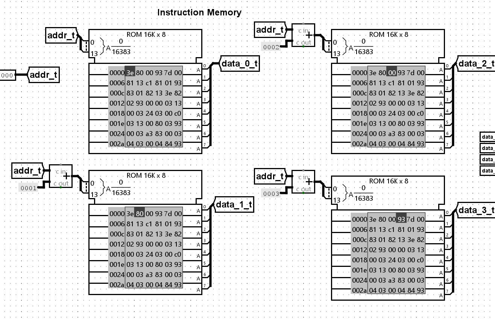

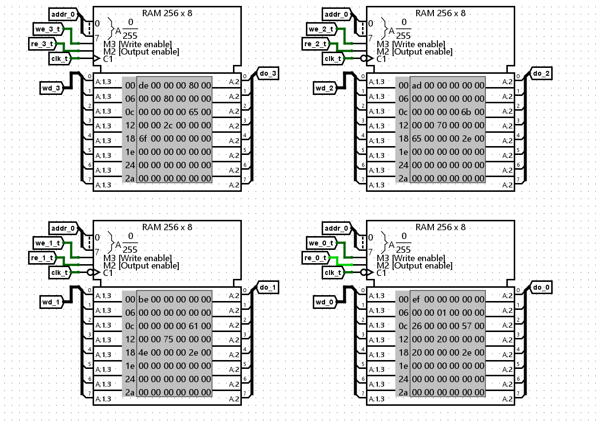

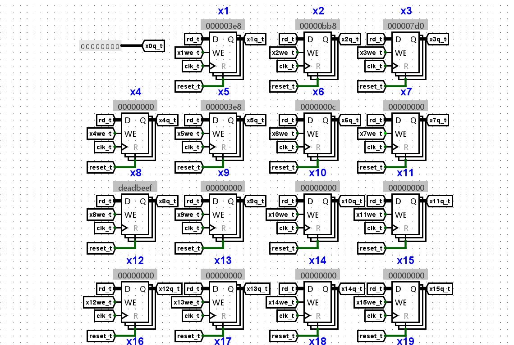

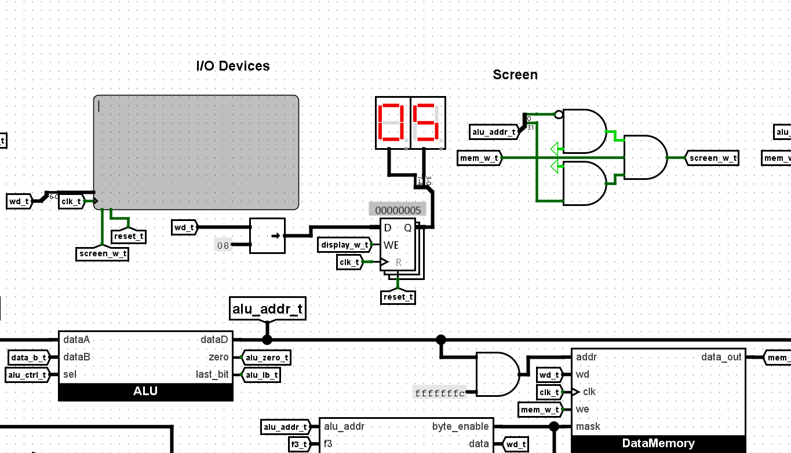

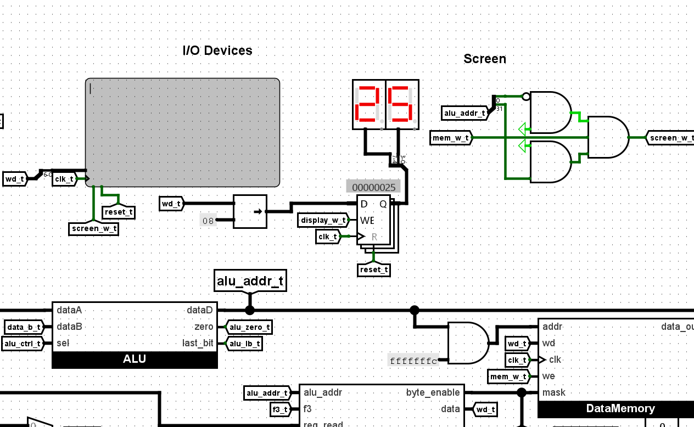

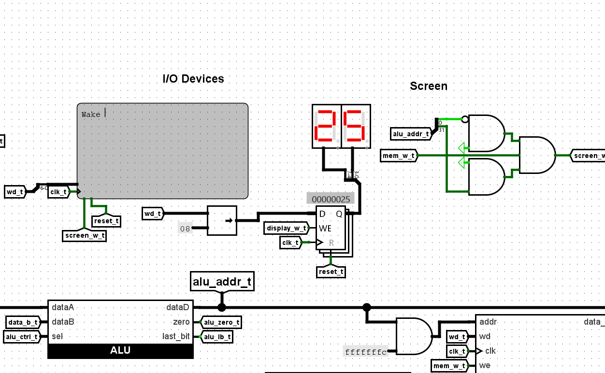

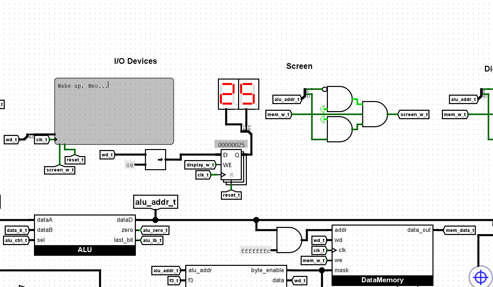

## Conclusions
The goals of this project are fulfiled, I learnt the RISC-V architecture and CPU design overall, it was a great experience.